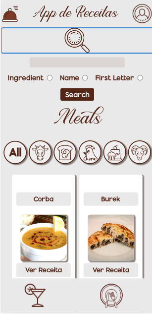

# App-de-Receitas

O App de Receitas é um aplicativo onde você encontra diversas receitas de comidas e drinks, simulando um livro de receitas que todo mundo gostaria de ter em casa!
Na aplicação você consegue realizar uma pesquisa por ingredientes, pelo nome de uma receita e pela primeira letra do nome de uma receita.
É possivel favoritar essa receita e tambem fazer o checklist dos ingredientes enquanto o usuario executa sua receita!

Acesse a apicacação [App de Receitas](https://aplicativo-de-receitas-18.vercel.app/).

Afinal é muito mais fácil fazer o preparo com um guia bem detalhado para executar aquela receita maravilhosa!

